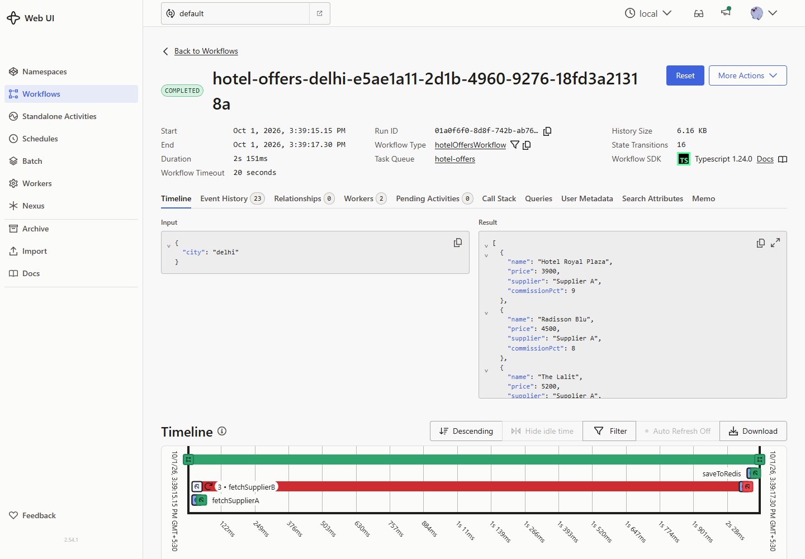

# Hotel Offer Orchestrator

[](https://github.com/mnmsagar/hotel-offer-orchestrator-tripare.ai/actions/workflows/ci.yml)

Aggregates hotel offers from two suppliers, de-duplicates hotels by name, keeps the best offer per hotel, caches the result in Redis, and serves price-range filters straight from Redis. The aggregation runs as a **Temporal** workflow.

**Stack:** Node.js 20 · TypeScript · Express 5 · Temporal (TypeScript SDK) · Redis 7 · Docker Compose

---

## Contents

- [Quick start (Docker)](#quick-start-docker)
- [Local setup (without Docker)](#local-setup-without-docker)
- [Configuration](#configuration)
- [Architecture](#architecture)
- [API](#api)
- [Postman collection](#postman-collection)
- [Simulating a supplier outage](#simulating-a-supplier-outage)
- [Viewing workflows in the Temporal UI](#viewing-workflows-in-the-temporal-ui)
- [Testing](#testing)
- [Design decisions](#design-decisions)
- [Project layout](#project-layout)

---

## Prerequisites

| For | You need |
|---|---|
| Docker setup | Docker Desktop / Docker Engine with Compose v2 |
| Local setup | Node.js **20+**, npm, a **Redis ≥ 6.2** server (for `ZRANGE … BYSCORE`), and a Temporal server (e.g. the [Temporal CLI](https://docs.temporal.io/cli) dev server) |

## Quick start (Docker)

```bash
docker compose up --build
```

This starts four services:

| Service | Purpose | URL |
|---|---|---|
| `api` | Express API + mock supplier endpoints | http://localhost:3000 |
| `worker` | Temporal worker (runs the workflow and activities) | – |
| `redis` | Redis 7 cache | localhost:6379 |
| `temporal` | Temporal dev server + Web UI (official `temporalio/temporal` image) | gRPC localhost:7233 · UI http://localhost:8080 |

The first run takes a few minutes to pull images and build. Check `docker compose ps` until `api`, `redis` and `temporal` show `(healthy)`, then:

```bash
curl "http://localhost:3000/api/hotels?city=delhi"
curl "http://localhost:3000/health"
```

Tear everything down (including volumes):

```bash
docker compose down -v
```

## Local setup (without Docker)

```bash
npm install
cp .env.example .env          # defaults point at localhost

# Infrastructure — any of these works:
temporal server start-dev     # Temporal CLI dev server (UI on http://localhost:8233)
docker run -p 6379:6379 redis:7-alpine

# In two terminals (the scripts don't load .env automatically; export the vars or use your shell's dotenv):
npm run dev:api               # Express API with watch
npm run dev:worker            # Temporal worker with watch
```

Build and run the compiled output:

```bash
npm run build
npm run start:api
npm run start:worker
```

Quality checks:

```bash
npm run typecheck
npm run lint
npm test
```

## Configuration

All env vars are parsed and validated once with `zod` in [src/lib/config.ts](src/lib/config.ts); the process exits with a readable error if any is invalid.

| Var | Default | Purpose |
|---|---|---|
| `PORT` | `3000` | API port |
| `NODE_ENV` | `development` | `production` disables the `/admin` routes |
| `LOG_LEVEL` | `info` | pino log level |
| `SUPPLIER_BASE_URL` | `http://api:3000` | Base URL activities use to call the mock suppliers |
| `SUPPLIER_TIMEOUT_MS` | `3000` | Per-request HTTP timeout for supplier calls |
| `TEMPORAL_ADDRESS` | `temporal:7233` | Temporal frontend |
| `TEMPORAL_NAMESPACE` | `default` | |
| `TEMPORAL_TASK_QUEUE` | `hotel-offers` | Task queue the worker polls |
| `WORKFLOW_TIMEOUT_MS` | `20000` | Workflow execution timeout (→ `504`) |
| `REDIS_URL` | `redis://redis:6379` | |
| `CACHE_TTL_SECONDS` | `300` | TTL of the per-city cache |
| `PARTIAL_CACHE_TTL_SECONDS` | `30` | Shorter TTL for results built while a supplier was down |
| `SUPPLIER_A_DOWN` / `SUPPLIER_B_DOWN` | `false` | Initial state of the outage toggle |

## Architecture

```
Client ──> Express API  GET /api/hotels?city=…[&minPrice][&maxPrice]
             │
             ├─ price filter given AND hotels:{city}:meta exists
             │      └──> Redis: ZRANGE BYSCORE + HMGET ──> response
             │
             └─ otherwise ──> Temporal client.workflow.start(hotelOffersWorkflow, { city })
                                   │  task queue "hotel-offers"
                                   ▼
                          Temporal Worker
                            hotelOffersWorkflow({ city })
                              ├─ fetchSupplierA(city) ┐ activities, in parallel,
                              ├─ fetchSupplierB(city) ┘ each retried up to 3×
                              ├─ selectBestOffers(a, b)   pure function, inside the workflow
                              └─ saveToRedis(city, offers) activity, MULTI transaction
                                   │
                                   ▼
                          API returns the result (or filters it from Redis)

Supplier activities ──HTTP──> GET /supplierA/hotels, GET /supplierB/hotels
                              (mock endpoints inside the same Express app)
```

- **Workflow** ([src/temporal/workflows/hotelOffers.workflow.ts](src/temporal/workflows/hotelOffers.workflow.ts)): deterministic orchestration only. No I/O, enforced by an ESLint rule on `src/temporal/workflows/**`.
- **Activities** ([src/temporal/activities/](src/temporal/activities/)): all I/O (HTTP to suppliers, Redis writes). Supplier `4xx` and invalid payloads are **non-retryable**; network errors, timeouts and `5xx` are retried.
- **API** ([src/api/](src/api/)): thin route handlers (validate → service → respond) and a central error middleware.

## API

### `GET /api/hotels?city=<city>[&minPrice=<n>][&maxPrice=<n>]`

| Rule | Behaviour |
|---|---|
| `city` | Required; normalized with `trim().toLowerCase()` |
| `minPrice`, `maxPrice` | Optional non-negative numbers, inclusive; either may be given alone |
| Validation error | `400 { "error": "…" }` |
| Unknown city / no matches | `200 []` |
| One supplier down | `200` with the other supplier's offers |
| Both suppliers down | `502 { "error": "All suppliers unavailable" }` |
| Workflow timed out (e.g. no worker running) | `504` after `WORKFLOW_TIMEOUT_MS` (20 s) |
| Temporal unreachable | `503 { "error": "Workflow service unavailable" }` within ~5 s |
| Redis unreachable, no price filter | `200`. The workflow result is returned and the failed cache write is only logged |
| Redis unreachable, price filter | `503 { "error": "Cache unavailable" }` within ~2 s |
| Price filter on a cached city while Temporal/worker is down | `200`, served from Redis |

```bash
# All offers for Delhi (always runs the workflow → fresh data)
curl "http://localhost:3000/api/hotels?city=delhi"

# Price filter (served from Redis when the city is cached)
curl "http://localhost:3000/api/hotels?city=delhi&minPrice=5000&maxPrice=6000"

# Only an upper bound
curl "http://localhost:3000/api/hotels?city=delhi&maxPrice=4000"

# Unknown city → []
curl "http://localhost:3000/api/hotels?city=atlantis"

# Validation error → 400
curl "http://localhost:3000/api/hotels?city=delhi&minPrice=6000&maxPrice=5000"
```

Example response:

```json
[
  { "name": "Bloomrooms", "price": 2800, "supplier": "Supplier B", "commissionPct": 7 },
  { "name": "Hotel Royal Plaza", "price": 3900, "supplier": "Supplier A", "commissionPct": 9 },
  { "name": "Radisson Blu", "price": 4500, "supplier": "Supplier A", "commissionPct": 8 }
]
```

### `GET /supplierA/hotels`, `GET /supplierB/hotels`

Mock suppliers backed by [src/data/](src/data/). Optional `?city=` filter. Return `503` while toggled down.

### `GET /health`

```json
{
  "status": "ok",
  "suppliers": { "supplierA": "up", "supplierB": "up" },
  "redis": "up",
  "temporal": "up"
}
```

`ok` = everything up · `degraded` = one supplier down · `down` = both suppliers, Redis or Temporal down. `200` for `ok`/`degraded`, `503` for `down`. Each probe has a 2 s timeout and they run in parallel.

`GET /health/live` is a plain liveness check (always `200` while the process is up), used by the container healthcheck.

### `POST /admin/suppliers/:id/status` (dev/demo only)

Body `{ "down": true | false }`; `:id` is `supplierA` or `supplierB`. Not mounted when `NODE_ENV=production`. `GET /admin/suppliers/status` shows the current toggles.

## Postman collection

1. In Postman, choose **Import** and select [postman/hotel-offer-orchestrator.postman_collection.json](postman/hotel-offer-orchestrator.postman_collection.json).
2. The collection variable `baseUrl` defaults to `http://localhost:3000`. Change it under the collection's **Variables** tab if needed.
3. Run it with the **Collection Runner**, keeping the default order. The outage folder (5a → 5d) depends on order: it marks Supplier B down, checks the partial result and `degraded` health, then restores B.

From the CLI: `npx newman run postman/hotel-offer-orchestrator.postman_collection.json`.

## Simulating a supplier outage

```bash
# Take Supplier B down
curl -X POST http://localhost:3000/admin/suppliers/supplierB/status \
  -H "Content-Type: application/json" -d '{"down": true}'

curl "http://localhost:3000/api/hotels?city=delhi"   # only Supplier A offers
curl "http://localhost:3000/health"                  # "status": "degraded"

# Take Supplier A down too → 502
curl -X POST http://localhost:3000/admin/suppliers/supplierA/status \
  -H "Content-Type: application/json" -d '{"down": true}'
curl -i "http://localhost:3000/api/hotels?city=delhi"

# Restore both
for s in supplierA supplierB; do
  curl -X POST http://localhost:3000/admin/suppliers/$s/status \
    -H "Content-Type: application/json" -d '{"down": false}'
done
```

You can also start with a supplier down: `SUPPLIER_B_DOWN=true docker compose up`.

A downed supplier answers `503`, which the activity treats as retryable. You will see three attempts (500 ms, then 1 s backoff) in the Temporal UI before the workflow continues with the other supplier.

## Viewing workflows in the Temporal UI

Open http://localhost:8080 (Docker) or http://localhost:8233 (`temporal server start-dev`), namespace `default`.

- Each request creates a workflow with ID `hotel-offers-<city>-<uuid>`. The request ID is stored in the workflow memo.
- Open a run to see its **event history**: both supplier activities scheduled in parallel, retry attempts, the cache write, and the result.
- During an outage, the failed supplier activity shows its attempts and error, while the workflow still completes.



*A run with Supplier B down. `fetchSupplierA` and `fetchSupplierB` start in parallel; A succeeds immediately, B is attempted 3 times (red bar, "3 •") and gives up, then `saveToRedis` caches the partial result with the short TTL. The workflow still completes with Supplier A's offers in about 2 s.*

## Testing

```bash
npm test
```

| Suite | What it covers |
|---|---|
| [test/selectBestOffers.test.ts](test/selectBestOffers.test.ts) | Overlap, cheaper wins, price tie → commission, full tie → Supplier A, single-supplier hotels, case/whitespace dedupe, empty input, ordering |
| [test/hotelOffers.workflow.test.ts](test/hotelOffers.workflow.test.ts) | Real workflow on Temporal's time-skipping test server with mocked activities: both succeed, one fails (3 attempts), non-retryable failure (1 attempt), both fail (`AllSuppliersUnavailable`), cache failure tolerated |
| [test/hotelCache.test.ts](test/hotelCache.test.ts) | Redis filtering via `ioredis-mock`: inclusive bounds, only min, only max, no match, cache miss vs cached-empty, stale replacement, TTLs |
| [test/api.test.ts](test/api.test.ts) | `supertest`: validation errors, cache hit/miss flow, 502/503/504/413/500 mapping, mock suppliers, admin toggle, health status codes |
| [test/integration.test.ts](test/integration.test.ts) | Real supplier activities and health checker against the running mock API: retryable vs non-retryable errors, `ok`/`degraded`/`down` |

The first run downloads Temporal's test server binary, so it needs network access.

**CI** ([.github/workflows/ci.yml](.github/workflows/ci.yml)) runs on every push and pull request in two jobs:
1. Typecheck, lint, the test suite above, and the production build.
2. An end-to-end run: `docker compose up --build --wait`, then the full Postman collection via `newman` against the live stack.

## Design decisions

### Best-offer selection and tie-break

[`selectBestOffers`](src/domain/selectBestOffers.ts) is a **pure** function: no I/O, clock or randomness. That makes it safe to call inside the workflow and easy to unit-test.

1. Hotels are matched on `name.trim().toLowerCase()`. The response uses the winning supplier's spelling.
2. The lower price wins.
3. **Tie-break:** on equal price, the higher `commissionPct` wins (better for the business). If commission is also equal, **Supplier A** wins. Every input therefore has exactly one winner, whatever order it arrives in.
4. Output is sorted by price, then by name, using code-point comparison rather than `localeCompare`, so ordering is the same on every machine.

The Delhi mock data covers each rule: B cheaper (Taj Palace), A cheaper (ITC Maurya), a price tie settled by commission (The Leela Ambience, spelled differently by each supplier), a full tie (Radisson Blu), and hotels unique to each supplier.

### Partial failure

The two supplier activities run in parallel. Each promise is "settled" into `{ ok, value | error }`, so one rejection cannot fail `Promise.all`. One failure gives a partial result plus a `warn` log. Two failures raise a non-retryable `ApplicationFailure` of type `AllSuppliersUnavailable`, which the API maps to `502`. A failed cache write is logged but doesn't fail the request, because the computed offers are still correct.

Retry policy: `startToCloseTimeout: 5s`, `maximumAttempts: 3`, `initialInterval: 500ms`, `backoffCoefficient: 2`. Worst case per supplier is about 3 × 3 s (the HTTP timeout) plus 1.5 s of backoff, which fits inside the 20 s workflow timeout.

### Redis key design

All key names come from one helper, [src/lib/redisKeys.ts](src/lib/redisKeys.ts):

| Key | Type | Content |
|---|---|---|
| `hotels:{city}:byPrice` | Sorted set | member = normalized hotel name, score = price |
| `hotels:{city}:data` | Hash | field = normalized hotel name, value = `HotelOffer` JSON |
| `hotels:{city}:meta` | String | `{ count, updatedAt, partial }`, which marks the city as cached |

- **Writes** use `MULTI`/`EXEC`: delete the three keys, `ZADD`, `HSET`, then set TTLs and the meta key. The transaction runs as one unit, so readers never see a half-updated city and stale hotels can't linger.
- **Reads** filter inside Redis. One pipelined round trip runs `EXISTS meta` and `ZRANGE byPrice <min> <max> BYSCORE`, with `-inf`/`+inf` for a missing bound. A second runs `HMGET data <names…>`. The sorted set returns members ordered by score, then by member, which matches the API's price-then-name ordering, so no JS sorting or filtering is needed.
- The **meta key** separates a cache miss (key absent → run the workflow) from "cached, zero hotels" (`count: 0` → return `[]`), so unknown cities are cached too.

### Caching strategy

- **No price filter:** the workflow always runs, so the response is fresh. Each run also refreshes the cache.
- **Price filter:** served from Redis if `hotels:{city}:meta` exists. Otherwise the workflow runs first to populate the cache, then the filter runs in Redis.
- Entries expire after `CACHE_TTL_SECONDS` (default 300 s).
- **Partial results** (one supplier was down) are cached with `PARTIAL_CACHE_TTL_SECONDS` (default 30 s) and flagged `partial: true` in the meta key. Filtered requests can still be served while a supplier is down, and the incomplete list ages out shortly after the supplier recovers instead of lingering for the full TTL.

### Other choices

- **Workflow ID** `hotel-offers-<city>-<uuid>` is generated in the API, not the workflow, which must stay deterministic.
- **Worker startup** retries the Temporal connection with capped exponential backoff instead of crashing while Temporal boots.
- **Temporal in Docker** uses the official `temporalio/temporal` image running `temporal server start-dev`: server, Web UI and the `default` namespace in one container, with in-memory state. It starts in seconds and has no database bootstrapping step, which suits a local demo. The deprecated `temporalio/auto-setup` + PostgreSQL combination was flaky on first boot. Workflow history is lost on restart, which is fine here since Redis is only a cache. A production deployment would run Temporal on a persistent store (PostgreSQL/Cassandra) or Temporal Cloud.
- **Docker base image** is `node:20-bookworm-slim`, not Alpine. Temporal's native `core-bridge` only ships glibc binaries, so the worker cannot run on Alpine's musl. A single multi-stage image runs either the API or the worker, as a non-root user.
- **ioredis 5** (not 6): `ioredis-mock` only supports ioredis 5, and it lets the Redis tests run without a server.
- **Workflow input** is an object (`{ city }`) rather than a positional string, so fields can be added later without breaking running workflows' signatures.
- **Versioning:** if the workflow logic changes in a way that alters its command sequence, in-flight runs could fail on replay. Runs here last seconds, so redeploying is fine; for long-running workflows use `patched()` / worker versioning.

## Project layout

```
src/
  api/            Express app, routes, middleware, services, supplier toggle
  temporal/       client, workflows (deterministic), activities (I/O)
  worker/         Temporal worker entrypoint
  domain/         types, pure selectBestOffers, shared failure identifiers
  data/           mock supplier datasets
  lib/            config (zod), logger (pino), redis client, redisKeys, hotelCache
test/             unit, workflow, Redis, API and integration tests
postman/          Postman collection
```
